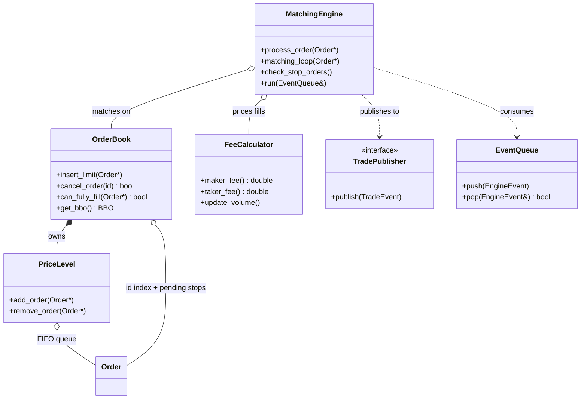

# High-Performance Order Matching Engine

A low-latency, price-time priority matching engine built in C++ for limit order book simulations and exchange system prototyping.

## Features

- Price-time priority (FIFO) matching
- Order types: `LIMIT`, `MARKET`, `IOC`, `FOK`, `STOP_LOSS`, `STOP_LIMIT`
- O(1) cancellation via order ID index
- Real-time BBO and L2 depth snapshots
- Volume-tiered maker-taker fee engine
- Event-driven trade publishing
- Thread-safe event queue for async order submission

---

## Architecture at a Glance



> Full UML set — detailed class, sequence, state, and flow diagrams — lives in [docs/uml.md](docs/uml.md).

---

## Documentation

- [Architecture & Design Decisions](docs/Architecture.md)
- [Order Types Reference](docs/OrderTypes.md)
- [Performance Audit](docs/Performance_Audit.md)
- [UML Diagrams](docs/uml.md)

---

## Building

```bash
mkdir build && cd build
cmake ..
make
./engine
```

Release build:

```bash
cmake .. -DCMAKE_BUILD_TYPE=Release
make
```

---

## Usage

### Limit Order

```cpp
OrderBook book;
FeeCalculator fees;
MatchingEngine engine(book, fees);

Order ask("seller", "S1", Side::SELL, OrderType::LIMIT, 101.0, 10, TimeUtils::now_ns());
Order buy("buyer", "B1", Side::BUY,  OrderType::LIMIT, 101.0,  5, TimeUtils::now_ns());

book.insert_limit(&ask);
engine.process_order(&buy);

book.cancel_order("S1"); // cancel resting remainder
```

### Market Order

```cpp
Order ask("seller", "S1", Side::SELL, OrderType::LIMIT, 100.0, 10, TimeUtils::now_ns());
Order buy("B1", Side::BUY, OrderType::MARKET, 6, TimeUtils::now_ns()); // user_id defaults

book.insert_limit(&ask);
engine.process_order(&buy); // sweeps at any price, never rests
```

### Stop-Loss Order

```cpp
// Triggers when last trade price >= 102.0, then executes as MARKET
Order stop("buyer", "ST1", Side::BUY, OrderType::STOP_LOSS,
           0.0,    // unused for STOP_LOSS
           5,
           102.0,  // stop_price
           TimeUtils::now_ns());

engine.process_stop_order(&stop);
```

### Fees

```cpp
InMemoryTradePublisher publisher;
engine.set_trade_publisher(&publisher);

// After a fill:
const TradeEvent& ev = publisher.events[0];
std::cout << "maker fee: " << ev.maker_fee << "\n";
std::cout << "taker fee: " << ev.taker_fee << "\n";
```

### Event-Driven (Async)

```cpp
EventQueue queue;
std::thread worker([&]() { engine.run(queue); });

queue.push(EngineEvent::New(&ask));
queue.push(EngineEvent::New(&buy));
queue.push(EngineEvent::Cancel("S1"));
queue.push(EngineEvent::Stop());

worker.join();
```

---

## Complexity

| Operation          | Complexity | Notes                         |
| ------------------ | ---------- | ----------------------------- |
| Limit insert       | O(log P)   | P = active price levels       |
| Market / IOC match | O(L + K)   | L = levels crossed, K = fills |
| FOK                | O(L + K)   | Includes pre-scan             |
| Cancel             | O(1) avg   | O(log P) if level emptied     |
| BBO read           | O(1)       | Cached pointer                |
| L2 snapshot        | O(D)       | D = requested depth           |
| Stop trigger scan  | O(S)       | S = pending stops, per pass   |

---

## Future Enhancements

- [ ] Multi-symbol routing (`symbol → OrderBook` map)
- [ ] Replace `std::map` with cache-friendly price level structure
- [ ] Integer tick pricing (`int64_t` fixed-point)
- [ ] Memory pooling for `Order` and `PriceLevel`
- [ ] `StopOrderManager` to decouple stop logic from `OrderBook`
- [ ] O(log S) stop trigger lookup via sorted stop-price index
- [ ] Lock-free `EventQueue`
- [ ] Trade streaming / ring buffer

---

## Author

[Shubh Garg](https://github.com/shubh-garg18)
