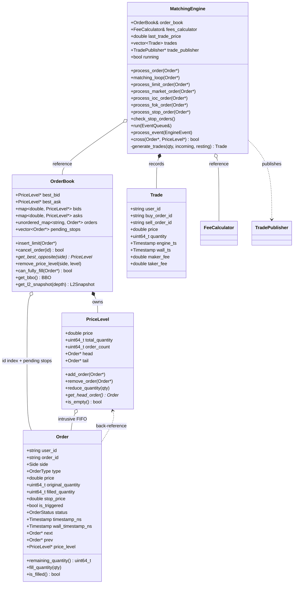
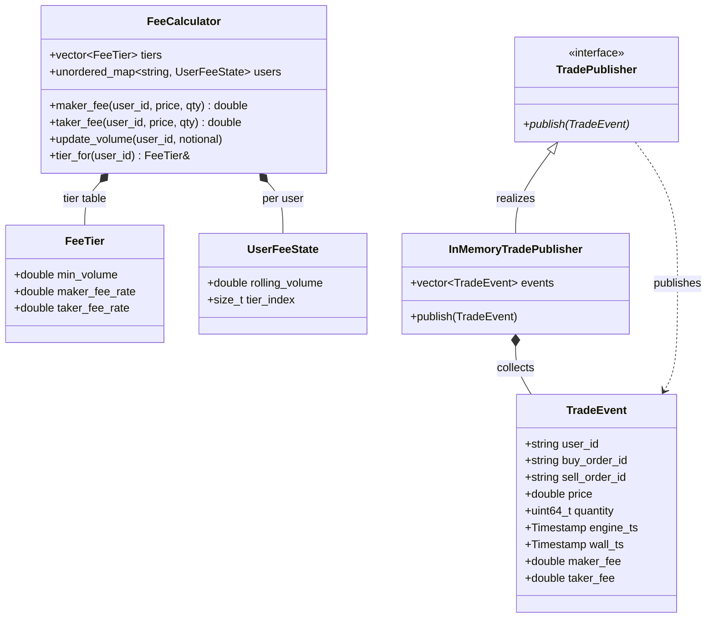
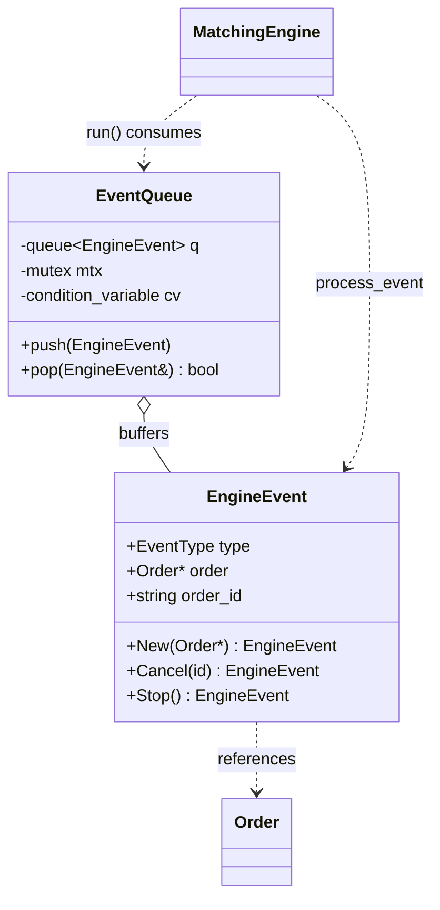
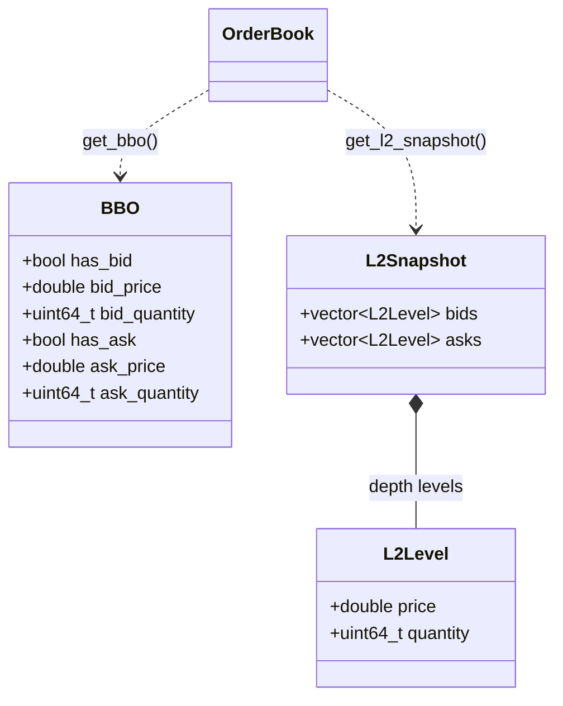
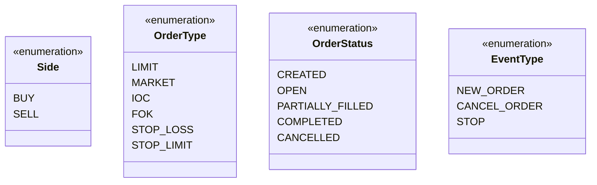
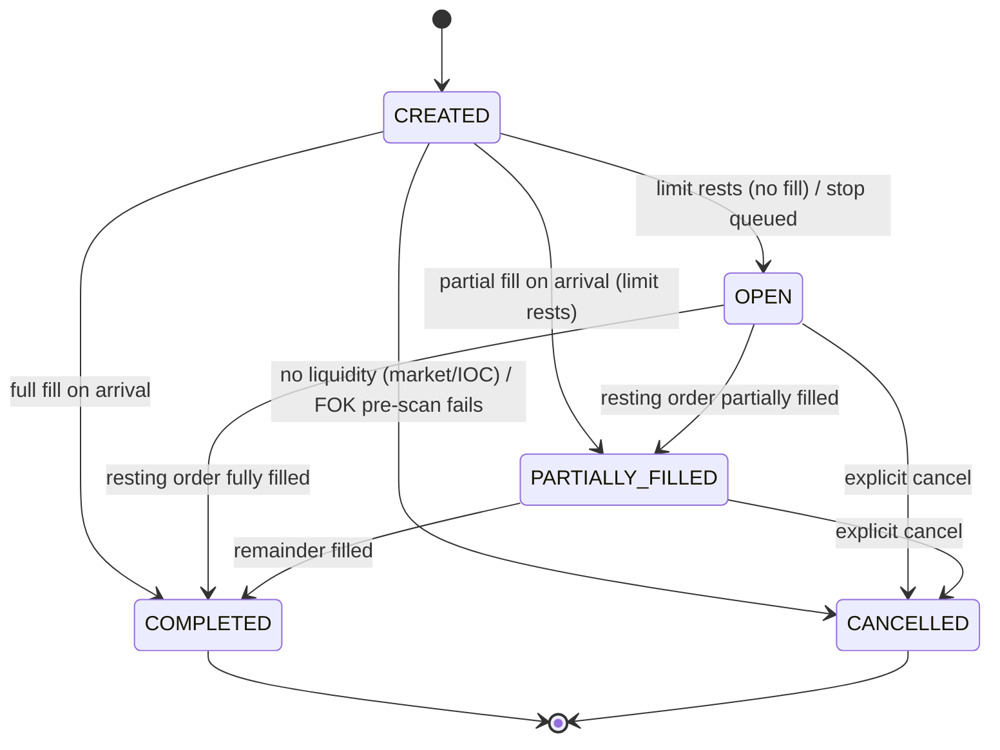
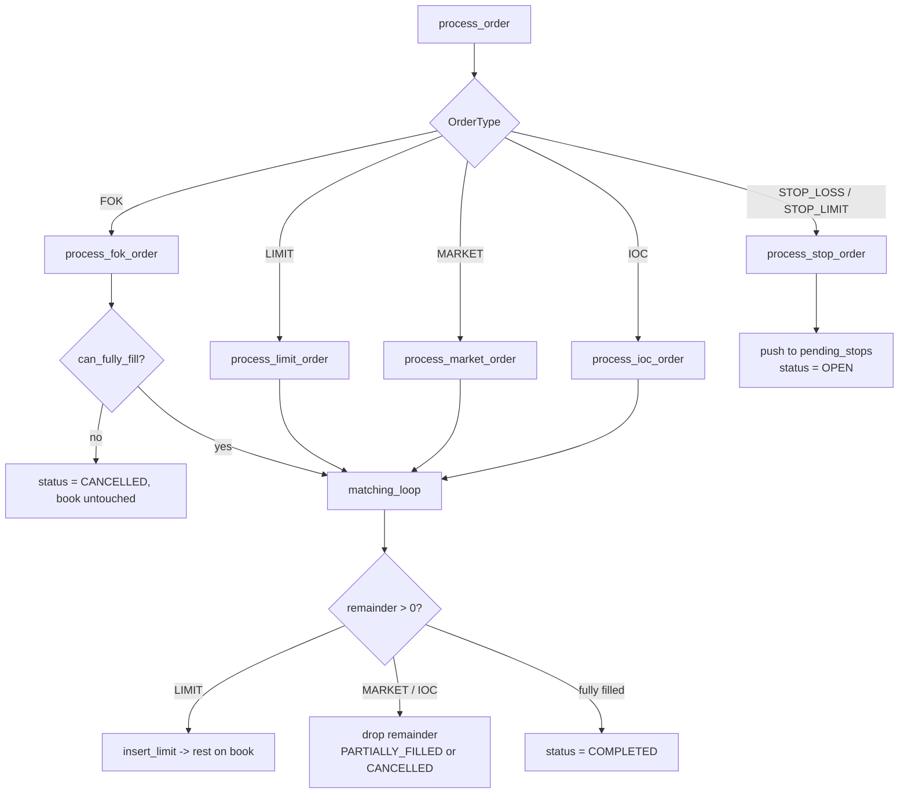
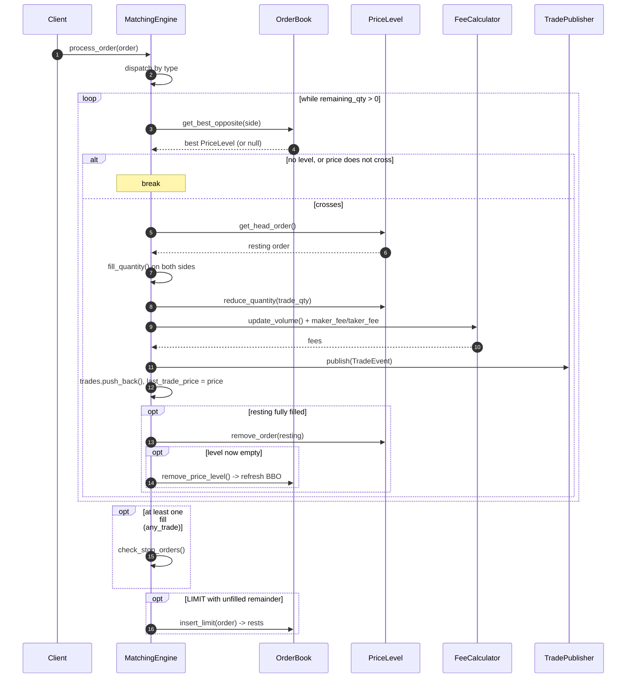
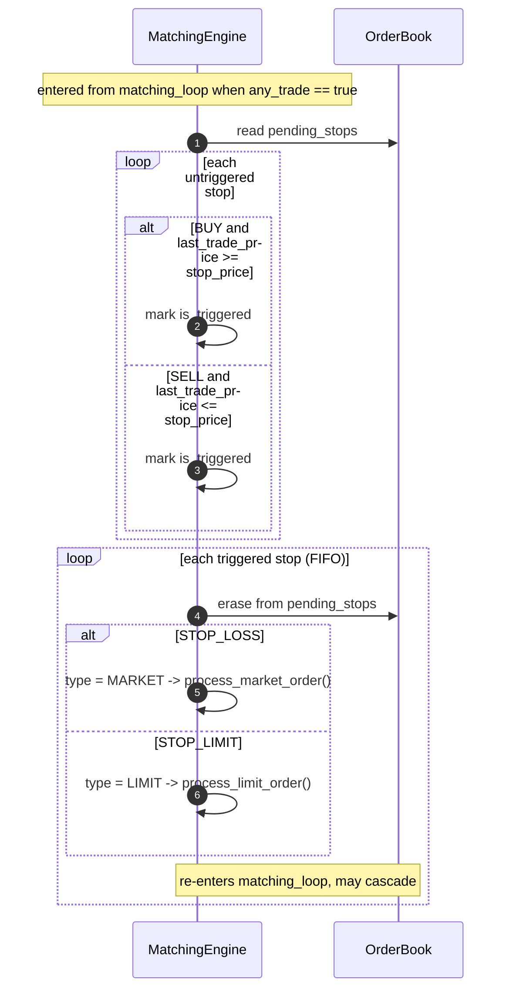
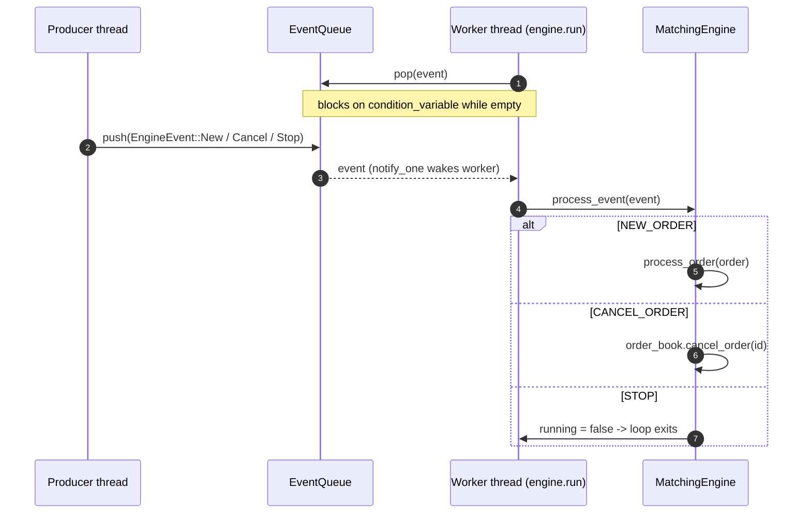

# UML Diagrams

Mermaid diagrams for the matching engine. They mirror the code in `include/` and
`src/` — class structure, the order lifecycle, order dispatch, and the runtime
flows for matching, stop triggering, and async submission.

For a single high-level overview, see the diagram in the
[README](../README.md#architecture-at-a-glance). This file holds the detailed set.

## Contents

- [Class Diagram — Core Matching](#class-diagram--core-matching)
- [Class Diagram — Fees & Publishing](#class-diagram--fees--publishing)
- [Class Diagram — Async & Events](#class-diagram--async--events)
- [Class Diagram — Market Data](#class-diagram--market-data)
- [Enumerations](#enumerations)
- [State Diagram — Order Lifecycle](#state-diagram--order-lifecycle)
- [Flowchart — Order Dispatch](#flowchart--order-dispatch)
- [Sequence — Aggressive Order Matching](#sequence--aggressive-order-matching)
- [Sequence — Stop-Order Triggering](#sequence--stop-order-triggering)
- [Sequence — Async Event Queue](#sequence--async-event-queue)

---

## Class Diagram — Core Matching

`MatchingEngine` owns references to one `OrderBook` and one `FeeCalculator`,
runs the shared matching loop, and records every fill as a `Trade`. `OrderBook`
owns its `PriceLevel`s (heap-allocated, deleted on emptying); each `PriceLevel`
holds an intrusive FIFO list of `Order`s. `OrderBook` also references orders via
its id index and its `pending_stops` list, but does not own them.

---

## Class Diagram — Fees & Publishing

`FeeCalculator` tracks per-user rolling volume and selects a `FeeTier` at trade
time (maker rebates kick in at higher tiers). Fills are emitted as immutable
`TradeEvent`s through the `TradePublisher` interface; `InMemoryTradePublisher`
is the test collector.

---

## Class Diagram — Async & Events

The async layer is a single-consumer command queue. Producers push
`EngineEvent`s; the worker thread running `MatchingEngine::run` blocks on `pop`
until an event arrives.

---

## Class Diagram — Market Data

Snapshot value types produced by `OrderBook`. `BBO` is an O(1) read off the
cached best pointers; `L2Snapshot` walks up to `depth` levels per side.

---

## Enumerations

---

## State Diagram — Order Lifecycle

`OrderStatus` transitions. An order starts `CREATED`; where it lands depends on
its type and available liquidity. `COMPLETED` and `CANCELLED` are terminal.

> Note: a pending (untriggered) stop sits in `OPEN` and has no cancel path yet —
> see the known limitation in [OrderTypes.md](OrderTypes.md).

---

## Flowchart — Order Dispatch

`process_order` routes by `OrderType`. LIMIT / MARKET / IOC go straight into the
matching loop; FOK pre-scans first; stops are parked in `pending_stops`.

---

## Sequence — Aggressive Order Matching

The hot path for a crossing order (e.g. a marketable limit buy). Each iteration
fills against the head of the best opposite level, prices the fill, publishes it,
and removes emptied levels. Stops are checked once, after the loop.

---

## Sequence — Stop-Order Triggering

`check_stop_orders` runs once at the tail of a matching pass. It marks stops
whose trigger condition is met against the latest `last_trade_price`, then
converts each to a MARKET (STOP_LOSS) or LIMIT (STOP_LIMIT) order — which
re-enters the matching loop and may itself trigger further stops (cascade).

---

## Sequence — Async Event Queue

Producers submit `EngineEvent`s from any thread; a single worker thread drains
them. `pop` blocks on a condition variable until an event is available. A `STOP`
event ends the loop.

